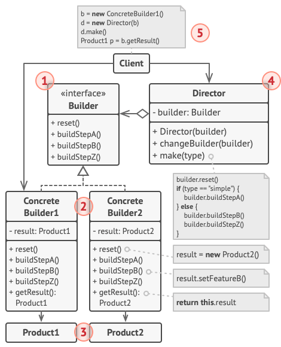
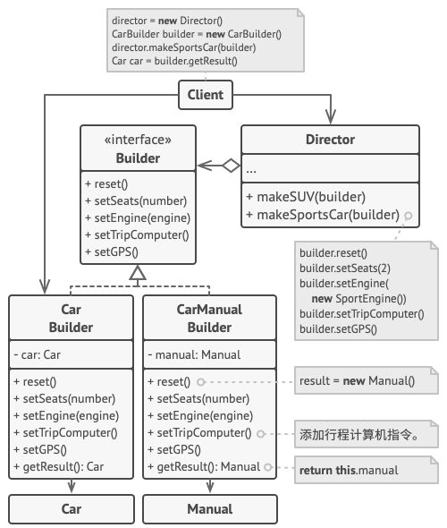

# 生成器 Builder

**生成器模式** 是一种创建型设计模式， 使你能够分步骤创建复杂对象。 该模式允许你使用相同的创建代码生成不同类型和形式的对象。

## 结构



### 1. 生成器

生成器 （Builder） 接口声明在所有类型生成器中通用的产品构造步骤。

### 2. 具体生成器

具体生成器 （Concrete Builders） 提供构造过程的不同实现。 具体生成器也可以构造不遵循通用接口的产品。

### 3. 产品

产品 （Products） 是最终生成的对象。 由不同生成器构造的产品无需属于同一类层次结构或接口。

### 4. 主管

主管 （Director） 类定义调用构造步骤的顺序， 这样你就可以创建和复用特定的产品配置。

### 5. 客户端

客户端 （Client） 必须将某个生成器对象与主管类关联。 一般情况下， 你只需通过主管类构造函数的参数进行一次性关联即可。 此后主管类就能使用生成器对象完成后续所有的构造任务。 但在客户端将生成器对象传递给主管类制造方法时还有另一种方式。 在这种情况下， 你在使用主管类生产产品时每次都可以使用不同的生成器。

## 伪代码



```c++
// 只有当产品较为复杂且需要详细配置时，使用生成器模式才有意义。下面的两个
// 产品尽管没有同样的接口，但却相互关联。
class Car is
    // 一辆汽车可能配备有 GPS 设备、行车电脑和几个座位。不同型号的汽车（
    // 运动型轿车、SUV 和敞篷车）可能会安装或启用不同的功能。

class Manual is
    // 用户使用手册应该根据汽车配置进行编制，并介绍汽车的所有功能。


// 生成器接口声明了创建产品对象不同部件的方法。
interface Builder is
    method reset()
    method setSeats(...)
    method setEngine(...)
    method setTripComputer(...)
    method setGPS(...)

// 具体生成器类将遵循生成器接口并提供生成步骤的具体实现。你的程序中可能会
// 有多个以不同方式实现的生成器变体。
class CarBuilder implements Builder is
    private field car:Car

    // 一个新的生成器实例必须包含一个在后续组装过程中使用的空产品对象。
    constructor CarBuilder() is
        this.reset()

    // reset（重置）方法可清除正在生成的对象。
    method reset() is
        this.car = new Car()

    // 所有生成步骤都会与同一个产品实例进行交互。
    method setSeats(...) is
        // 设置汽车座位的数量。

    method setEngine(...) is
        // 安装指定的引擎。

    method setTripComputer(...) is
        // 安装行车电脑。

    method setGPS(...) is
        // 安装全球定位系统。

    // 具体生成器需要自行提供获取结果的方法。这是因为不同类型的生成器可能
    // 会创建不遵循相同接口的、完全不同的产品。所以也就无法在生成器接口中
    // 声明这些方法（至少在静态类型的编程语言中是这样的）。
    //
    // 通常在生成器实例将结果返回给客户端后，它们应该做好生成另一个产品的
    // 准备。因此生成器实例通常会在 `getProduct（获取产品）`方法主体末尾
    // 调用重置方法。但是该行为并不是必需的，你也可让生成器等待客户端明确
    // 调用重置方法后再去处理之前的结果。
    method getProduct():Car is
        product = this.car
        this.reset()
        return product

// 生成器与其他创建型模式的不同之处在于：它让你能创建不遵循相同接口的产品。
class CarManualBuilder implements Builder is
    private field manual:Manual

    constructor CarManualBuilder() is
        this.reset()

    method reset() is
        this.manual = new Manual()

    method setSeats(...) is
        // 添加关于汽车座椅功能的文档。

    method setEngine(...) is
        // 添加关于引擎的介绍。

    method setTripComputer(...) is
        // 添加关于行车电脑的介绍。

    method setGPS(...) is
        // 添加关于 GPS 的介绍。

    method getProduct():Manual is
        // 返回使用手册并重置生成器。


// 主管只负责按照特定顺序执行生成步骤。其在根据特定步骤或配置来生成产品时
// 会很有帮助。由于客户端可以直接控制生成器，所以严格意义上来说，主管类并
// 不是必需的。
class Director is
    private field builder:Builder

    // 主管可同由客户端代码传递给自身的任何生成器实例进行交互。客户端可通
    // 过这种方式改变最新组装完毕的产品的最终类型。
    method setBuilder(builder:Builder)
        this.builder = builder

    // 主管可使用同样的生成步骤创建多个产品变体。
    method constructSportsCar(builder: Builder) is
        builder.reset()
        builder.setSeats(2)
        builder.setEngine(new SportEngine())
        builder.setTripComputer(true)
        builder.setGPS(true)

    method constructSUV(builder: Builder) is
        // ...


// 客户端代码会创建生成器对象并将其传递给主管，然后执行构造过程。最终结果
// 将需要从生成器对象中获取。
class Application is

    method makeCar() is
        director = new Director()

        CarBuilder builder = new CarBuilder()
        director.constructSportsCar(builder)
        Car car = builder.getProduct()

        CarManualBuilder builder = new CarManualBuilder()
        director.constructSportsCar(builder)

        // 最终产品通常需要从生成器对象中获取，因为主管不知晓具体生成器和
        // 产品的存在，也不会对其产生依赖。
        Manual manual = builder.getProduct()
```
