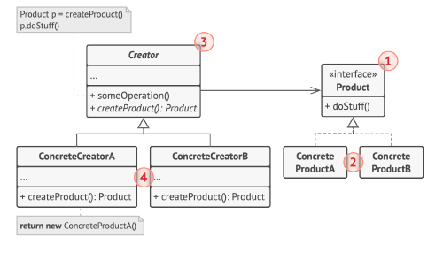
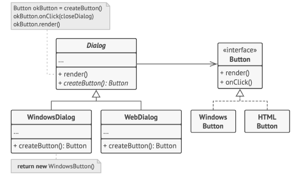

# 工厂方法 Factory Method

**工厂方法** 是一种创建型设计模式，其在父类中提供一个创建对象的方法，允许子类决定实例化对象的类型。

## 结构



### 1.产品

产品 （Product） 将会对接口进行声明。 对于所有由创建者及其子类构建的对象， 这些接口都是通用的。

### 2. 具体产品

具体产品 （Concrete Products） 是产品接口的不同实现。

### 3. 创建者

创建者 （Creator） 类声明返回产品对象的工厂方法。 该方法的返回对象类型必须与产品接口相匹配。

你可以将工厂方法声明为抽象方法， 强制要求每个子类以不同方式实现该方法。 或者， 你也可以在基础工厂方法中返回默认产品类型。

注意， 尽管它的名字是创建者， 但他最主要的职责并不是创建产品。 一般来说， 创建者类包含一些与产品相关的核心业务逻辑。 工厂方法将这些逻辑处理从具体产品类中分离出来。 打个比方， 大型软件开发公司拥有程序员培训部门。 但是， 这些公司的主要工作还是编写代码， 而非生产程序员。

### 4. 具体创建者

具体创建者 （Concrete Creators） 将会重写基础工厂方法， 使其返回不同类型的产品。

注意， 并不一定每次调用工厂方法都会创建新的实例。 工厂方法也可以返回缓存、 对象池或其他来源的已有对象。

## 伪代码



```c++
// 创建者类声明的工厂方法必须返回一个产品类的对象。创建者的子类通常会提供
// 该方法的实现。
class Dialog is
    // 创建者还可提供一些工厂方法的默认实现。
    abstract method createButton():Button

    // 请注意，创建者的主要职责并非是创建产品。其中通常会包含一些核心业务
    // 逻辑，这些逻辑依赖于由工厂方法返回的产品对象。子类可通过重写工厂方
    // 法并使其返回不同类型的产品来间接修改业务逻辑。
    method render() is
        // 调用工厂方法创建一个产品对象。
        Button okButton = createButton()
        // 现在使用产品。
        okButton.onClick(closeDialog)
        okButton.render()


// 具体创建者将重写工厂方法以改变其所返回的产品类型。
class WindowsDialog extends Dialog is
    method createButton():Button is
        return new WindowsButton()

class WebDialog extends Dialog is
    method createButton():Button is
        return new HTMLButton()


// 产品接口中将声明所有具体产品都必须实现的操作。
interface Button is
    method render()
    method onClick(f)

// 具体产品需提供产品接口的各种实现。
class WindowsButton implements Button is
    method render(a, b) is
        // 根据 Windows 样式渲染按钮。
    method onClick(f) is
        // 绑定本地操作系统点击事件。

class HTMLButton implements Button is
    method render(a, b) is
        // 返回一个按钮的 HTML 表述。
    method onClick(f) is
        // 绑定网络浏览器的点击事件。


class Application is
    field dialog: Dialog

    // 程序根据当前配置或环境设定选择创建者的类型。
    method initialize() is
        config = readApplicationConfigFile()

        if (config.OS == "Windows") then
            dialog = new WindowsDialog()
        else if (config.OS == "Web") then
            dialog = new WebDialog()
        else
            throw new Exception("错误！未知的操作系统。")

    // 当前客户端代码会与具体创建者的实例进行交互，但是必须通过其基本接口
    // 进行。只要客户端通过基本接口与创建者进行交互，你就可将任何创建者子
    // 类传递给客户端。
    method main() is
        this.initialize()
        dialog.render()
```
