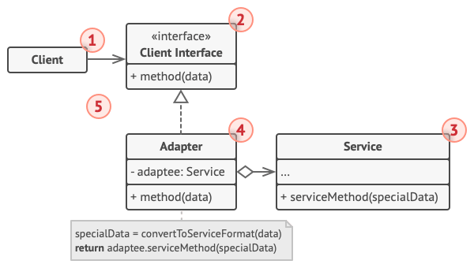
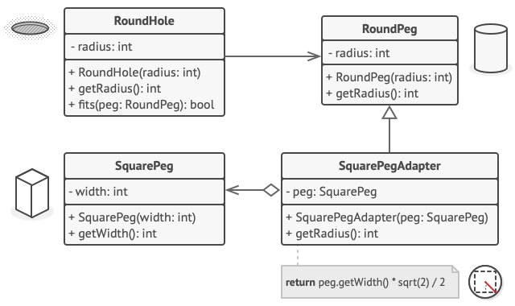

# 适配器模式 Adapter

**适配器模式** 是一种结构型设计模式， 它能使接口不兼容的对象能够相互合作。

## 结构

### 对象适配器



#### 1. 客户端

原型 （Prototype） 接口将对克隆方法进行声明。 在绝大多数情况下， 其中只会有一个名为 clone克隆的方法。

#### 2. 客户端接口

客户端接口 （Client Interface） 描述了其他类与客户端代码合作时必须遵循的协议。

#### 3. 服务

服务 （Service） 中有一些功能类 （通常来自第三方或遗留系统）。 客户端与其接口不兼容， 因此无法直接调用其功能。

#### 4. 适配器

适配器 （Adapter） 是一个可以同时与客户端和服务交互的类： 它在实现客户端接口的同时封装了服务对象。 适配器接受客户端通过适配器接口发起的调用， 并将其转换为适用于被封装服务对象的调用。

客户端代码只需通过接口与适配器交互即可， 无需与具体的适配器类耦合。 因此， 你可以向程序中添加新类型的适配器而无需修改已有代码。 这在服务类的接口被更改或替换时很有用： 你无需修改客户端代码就可以创建新的适配器类。

### 类适配器


#### 1. 类适配器

类适配器表不需要封装任何对象， 因为它同时继承了客户端和服务的行为。 适配功能在重写的方法中完成。 最后生成的适配器可替代已有的客户端类进行使用。

## 伪代码



```c++
// 假设你有两个接口相互兼容的类：圆孔（Round­Hole）和圆钉（Round­Peg）。
class RoundHole is
    constructor RoundHole(radius) { ... }

    method getRadius() is
        // 返回孔的半径。

    method fits(peg: RoundPeg) is
        return this.getRadius() >= peg.radius()

class RoundPeg is
    constructor RoundPeg(radius) { ... }

    method getRadius() is
        // 返回钉子的半径。


// 但还有一个不兼容的类：方钉（Square­Peg）。
class SquarePeg is
    constructor SquarePeg(width) { ... }

    method getWidth() is
        // 返回方钉的宽度。


// 适配器类让你能够将方钉放入圆孔中。它会对 RoundPeg 类进行扩展，以接收适
// 配器对象作为圆钉。
class SquarePegAdapter extends RoundPeg is
    // 在实际情况中，适配器中会包含一个 SquarePeg 类的实例。
    private field peg: SquarePeg

    constructor SquarePegAdapter(peg: SquarePeg) is
        this.peg = peg

    method getRadius() is
        // 适配器会假扮为一个圆钉，
        // 其半径刚好能与适配器实际封装的方钉搭配起来。
        return peg.getWidth() * Math.sqrt(2) / 2


// 客户端代码中的某个位置。
hole = new RoundHole(5)
rpeg = new RoundPeg(5)
hole.fits(rpeg) // true

small_sqpeg = new SquarePeg(5)
large_sqpeg = new SquarePeg(10)
hole.fits(small_sqpeg) // 此处无法编译（类型不一致）。

small_sqpeg_adapter = new SquarePegAdapter(small_sqpeg)
large_sqpeg_adapter = new SquarePegAdapter(large_sqpeg)
hole.fits(small_sqpeg_adapter) // true
hole.fits(large_sqpeg_adapter) // false
```
