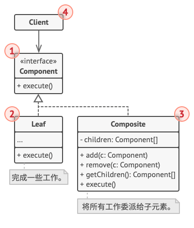
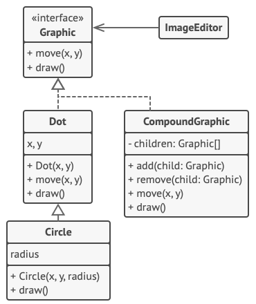

# 组合模式 Composite

**组合模式** 是一种结构型设计模式， 你可以使用它将对象组合成树状结构， 并且能像使用独立对象一样使用它们。

## 结构



### 1. 组件

组件 （Component） 接口描述了树中简单项目和复杂项目所共有的操作。

### 2. 叶节点

叶节点 （Leaf） 是树的基本结构， 它不包含子项目。

一般情况下， 叶节点最终会完成大部分的实际工作， 因为它们无法将工作指派给其他部分。

### 3. 容器

容器 （Container）——又名 “组合 （Composite）”——是包含叶节点或其他容器等子项目的单位。 容器不知道其子项目所属的具体类， 它只通过通用的组件接口与其子项目交互。

容器接收到请求后会将工作分配给自己的子项目， 处理中间结果， 然后将最终结果返回给客户端。

### 4. 客户端

客户端 （Client） 通过组件接口与所有项目交互。 因此， 客户端能以相同方式与树状结构中的简单或复杂项目交互。

## 伪代码



```c++
// 组件接口会声明组合中简单和复杂对象的通用操作。
interface Graphic is
    method move(x, y)
    method draw()

// 叶节点类代表组合的终端对象。叶节点对象中不能包含任何子对象。叶节点对象
// 通常会完成实际的工作，组合对象则仅会将工作委派给自己的子部件。
class Dot implements Graphic is
    field x, y

    constructor Dot(x, y) { ... }

    method move(x, y) is
        this.x += x, this.y += y

    method draw() is
        // 在坐标位置(X,Y)处绘制一个点。

// 所有组件类都可以扩展其他组件。
class Circle extends Dot is
    field radius

    constructor Circle(x, y, radius) { ... }

    method draw() is
        // 在坐标位置(X,Y)处绘制一个半径为 R 的圆。

// 组合类表示可能包含子项目的复杂组件。组合对象通常会将实际工作委派给子项
// 目，然后“汇总”结果。
class CompoundGraphic implements Graphic is
    field children: array of Graphic

    // 组合对象可在其项目列表中添加或移除其他组件（简单的或复杂的皆可）。
    method add(child: Graphic) is
        // 在子项目数组中添加一个子项目。

    method remove(child: Graphic) is
        // 从子项目数组中移除一个子项目。

    method move(x, y) is
        foreach (child in children) do
            child.move(x, y)

    // 组合会以特定的方式执行其主要逻辑。它会递归遍历所有子项目，并收集和
    // 汇总其结果。由于组合的子项目也会将调用传递给自己的子项目，以此类推，
    // 最后组合将会完成整个对象树的遍历工作。
    method draw() is
        // 1. 对于每个子部件：
        //     - 绘制该部件。
        //     - 更新边框坐标。
        // 2. 根据边框坐标绘制一个虚线长方形。


// 客户端代码会通过基础接口与所有组件进行交互。这样一来，客户端代码便可同
// 时支持简单叶节点组件和复杂组件。
class ImageEditor is
    field all: array of Graphic

    method load() is
        all = new CompoundGraphic()
        all.add(new Dot(1, 2))
        all.add(new Circle(5, 3, 10))
        // ...

    // 将所需组件组合为复杂的组合组件。
    method groupSelected(components: array of Graphic) is
        group = new CompoundGraphic()
        foreach (component in components) do
            group.add(component)
            all.remove(component)
        all.add(group)
        // 所有组件都将被绘制。
        all.draw()
```
