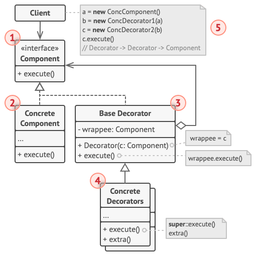

# 装饰模式 Decorator

**装饰模式** 是一种结构型设计模式， 允许你通过将对象放入包含行为的特殊封装对象中来为原对象绑定新的行为。

## 结构



### 1. 部件

部件 （Component） 声明封装器和被封装对象的公用接口。

### 2. 具体部件

具体部件 （Concrete Component） 类是被封装对象所属的类。 它定义了基础行为， 但装饰类可以改变这些行为。

### 3. 基础装饰

基础装饰 （Base Decorator） 类拥有一个指向被封装对象的引用成员变量。 该变量的类型应当被声明为通用部件接口， 这样它就可以引用具体的部件和装饰。 装饰基类会将所有操作委派给被封装的对象。

### 4. 具体装饰类

具体装饰类 （Concrete Decorators） 定义了可动态添加到部件的额外行为。 具体装饰类会重写装饰基类的方法， 并在调用父类方法之前或之后进行额外的行为。

### 5. 客户端

客户端 （Client） 可以使用多层装饰来封装部件， 只要它能使用通用接口与所有对象互动即可。

## 伪代码


```c++
// 装饰可以改变组件接口所定义的操作。
interface DataSource is
    method writeData(data)
    method readData():data

// 具体组件提供操作的默认实现。这些类在程序中可能会有几个变体。
class FileDataSource implements DataSource is
    constructor FileDataSource(filename) { ... }

    method writeData(data) is
        // 将数据写入文件。

    method readData():data is
        // 从文件读取数据。

// 装饰基类和其他组件遵循相同的接口。该类的主要任务是定义所有具体装饰的封
// 装接口。封装的默认实现代码中可能会包含一个保存被封装组件的成员变量，并
// 且负责对其进行初始化。
class DataSourceDecorator implements DataSource is
    protected field wrappee: DataSource

    constructor DataSourceDecorator(source: DataSource) is
        wrappee = source

    // 装饰基类会直接将所有工作分派给被封装组件。具体装饰中则可以新增一些
    // 额外的行为。
    method writeData(data) is
        wrappee.writeData(data)

    // 具体装饰可调用其父类的操作实现，而不是直接调用被封装对象。这种方式
    // 可简化装饰类的扩展工作。
    method readData():data is
        return wrappee.readData()

// 具体装饰必须在被封装对象上调用方法，不过也可以自行在结果中添加一些内容。
// 装饰必须在调用封装对象之前或之后执行额外的行为。
class EncryptionDecorator extends DataSourceDecorator is
    method writeData(data) is
        // 1. 对传递数据进行加密。
        // 2. 将加密后数据传递给被封装对象 writeData（写入数据）方法。

    method readData():data is
        // 1. 通过被封装对象的 readData（读取数据）方法获取数据。
        // 2. 如果数据被加密就尝试解密。
        // 3. 返回结果。

// 你可以将对象封装在多层装饰中。
class CompressionDecorator extends DataSourceDecorator is
    method writeData(data) is
        // 1. 压缩传递数据。
        // 2. 将压缩后数据传递给被封装对象 writeData（写入数据）方法。

    method readData():data is
        // 1. 通过被封装对象的 readData（读取数据）方法获取数据。
        // 2. 如果数据被压缩就尝试解压。
        // 3. 返回结果。


// 选项 1：装饰组件的简单示例
class Application is
    method dumbUsageExample() is
        source = new FileDataSource("somefile.dat")
        source.writeData(salaryRecords)
        // 已将明码数据写入目标文件。

        source = new CompressionDecorator(source)
        source.writeData(salaryRecords)
        // 已将压缩数据写入目标文件。

        source = new EncryptionDecorator(source)
        // 源变量中现在包含：
        // Encryption > Compression > FileDataSource
        source.writeData(salaryRecords)
        // 已将压缩且加密的数据写入目标文件。


// 选项 2：客户端使用外部数据源。SalaryManager（工资管理器）对象并不关心
// 数据如何存储。它们会与提前配置好的数据源进行交互，数据源则是通过程序配
// 置器获取的。
class SalaryManager is
    field source: DataSource

    constructor SalaryManager(source: DataSource) { ... }

    method load() is
        return source.readData()

    method save() is
        source.writeData(salaryRecords)
    // ...其他有用的方法...


// 程序可在运行时根据配置或环境组装不同的装饰堆桟。
class ApplicationConfigurator is
    method configurationExample() is
        source = new FileDataSource("salary.dat")
        if (enabledEncryption)
            source = new EncryptionDecorator(source)
        if (enabledCompression)
            source = new CompressionDecorator(source)

        logger = new SalaryManager(source)
        salary = logger.load()
    // ...
```
