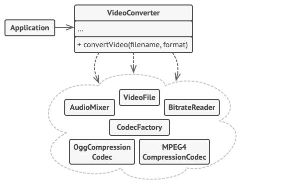

# 外观模式 Facade

**外观模式** 是一种结构型设计模式， 能为程序库、 框架或其他复杂类提供一个简单的接口。

## 结构


### 1. 外观

外观 （Facade） 提供了一种访问特定子系统功能的便捷方式， 其了解如何重定向客户端请求， 知晓如何操作一切活动部件。

### 2. 附加外观

创建附加外观 （Additional Facade） 类可以避免多种不相关的功能污染单一外观， 使其变成又一个复杂结构。 客户端和其他外观都可使用附加外观。

### 3. 复杂子系统

复杂子系统 （Complex Subsystem） 由数十个不同对象构成。 如果要用这些对象完成有意义的工作， 你必须深入了解子系统的实现细节， 比如按照正确顺序初始化对象和为其提供正确格式的数据。

子系统类不会意识到外观的存在， 它们在系统内运作并且相互之间可直接进行交互。

### 4. 客户端

客户端 （Client） 使用外观代替对子系统对象的直接调用。

## 伪代码



```c++
// 这里有复杂第三方视频转换框架中的一些类。我们不知晓其中的代码，因此无法
// 对其进行简化。

class VideoFile
// ...

class OggCompressionCodec
// ...

class MPEG4CompressionCodec
// ...

class CodecFactory
// ...

class BitrateReader
// ...

class AudioMixer
// ...


// 为了将框架的复杂性隐藏在一个简单接口背后，我们创建了一个外观类。它是在
// 功能性和简洁性之间做出的权衡。
class VideoConverter is
    method convert(filename, format):File is
        file = new VideoFile(filename)
        sourceCodec = new CodecFactory.extract(file)
        if (format == "mp4")
            destinationCodec = new MPEG4CompressionCodec()
        else
            destinationCodec = new OggCompressionCodec()
        buffer = BitrateReader.read(filename, sourceCodec)
        result = BitrateReader.convert(buffer, destinationCodec)
        result = (new AudioMixer()).fix(result)
        return new File(result)

// 应用程序的类并不依赖于复杂框架中成千上万的类。同样，如果你决定更换框架，
// 那只需重写外观类即可。
class Application is
    method main() is
        convertor = new VideoConverter()
        mp4 = convertor.convert("funny-cats-video.ogg", "mp4")
        mp4.save()
```
