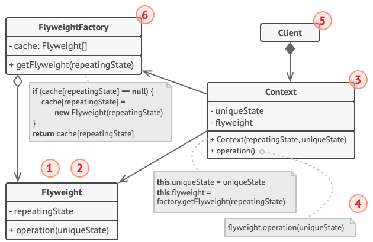

# 享元模式 Flyweight

**享元模式** 是一种结构型设计模式， 它摒弃了在每个对象中保存所有数据的方式， 通过共享多个对象所共有的相同状态， 让你能在有限的内存容量中载入更多对象。

## 结构



### 1. 享元

享元模式只是一种优化。 在应用该模式之前， 你要确定程序中存在与大量类似对象同时占用内存相关的内存消耗问题， 并且确保该问题无法使用其他更好的方式来解决。

享元 （Flyweight） 类包含原始对象中部分能在多个对象中共享的状态。 同一享元对象可在许多不同情景中使用。 享元中存储的状态被称为 “内在状态”。 传递给享元方法的状态被称为 “外在状态”。

### 2. 情景

情景 （Context） 类包含原始对象中各不相同的外在状态。 情景与享元对象组合在一起就能表示原始对象的全部状态。

通常情况下， 原始对象的行为会保留在享元类中。 因此调用享元方法必须提供部分外在状态作为参数。 但你也可将行为移动到情景类中， 然后将连入的享元作为单纯的数据对象。

### 3. 客户端

客户端 （Client） 负责计算或存储享元的外在状态。 在客户端看来， 享元是一种可在运行时进行配置的模板对象， 具体的配置方式为向其方法中传入一些情景数据参数。

### 4. 享元工厂

享元工厂 （Flyweight Factory） 会对已有享元的缓存池进行管理。 有了工厂后， 客户端就无需直接创建享元， 它们只需调用工厂并向其传递目标享元的一些内在状态即可。 工厂会根据参数在之前已创建的享元中进行查找， 如果找到满足条件的享元就将其返回； 如果没有找到就根据参数新建享元。

## 伪代码


```c++
// 享元类包含一个树的部分状态。这些成员变量保存的数值对于特定树而言是唯一
// 的。例如，你在这里找不到树的坐标。但这里有很多树木之间所共有的纹理和颜
// 色。由于这些数据的体积通常非常大，所以如果让每棵树都其进行保存的话将耗
// 费大量内存。因此，我们可将纹理、颜色和其他重复数据导出到一个单独的对象
// 中，然后让众多的单个树对象去引用它。
class TreeType is
    field name
    field color
    field texture
    constructor TreeType(name, color, texture) { ... }
    method draw(canvas, x, y) is
        // 1. 创建特定类型、颜色和纹理的位图。
        // 2. 在画布坐标 (X,Y) 处绘制位图。

// 享元工厂决定是否复用已有享元或者创建一个新的对象。
class TreeFactory is
    static field treeTypes: collection of tree types
    static method getTreeType(name, color, texture) is
        type = treeTypes.find(name, color, texture)
        if (type == null)
            type = new TreeType(name, color, texture)
            treeTypes.add(type)
        return type

// 情景对象包含树状态的外在部分。程序中可以创建数十亿个此类对象，因为它们
// 体积很小：仅有两个整型坐标和一个引用成员变量。
class Tree is
    field x,y
    field type: TreeType
    constructor Tree(x, y, type) { ... }
    method draw(canvas) is
        type.draw(canvas, this.x, this.y)

// 树（Tree）和森林（Forest）类是享元的客户端。如果不打算继续对树类进行开
// 发，你可以将它们合并。
class Forest is
    field trees: collection of Trees

    method plantTree(x, y, name, color, texture) is
        type = TreeFactory.getTreeType(name, color, texture)
        tree = new Tree(x, y, type)
        trees.add(tree)

    method draw(canvas) is
        foreach (tree in trees) do
            tree.draw(canvas)
```
